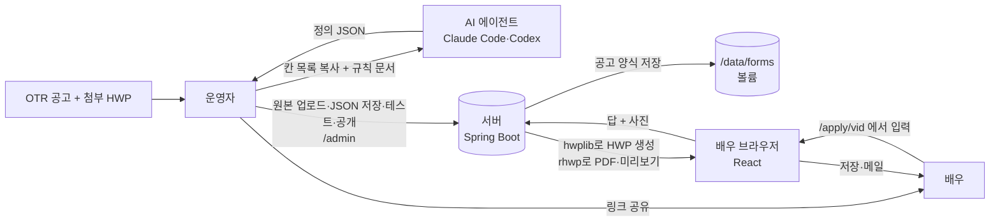
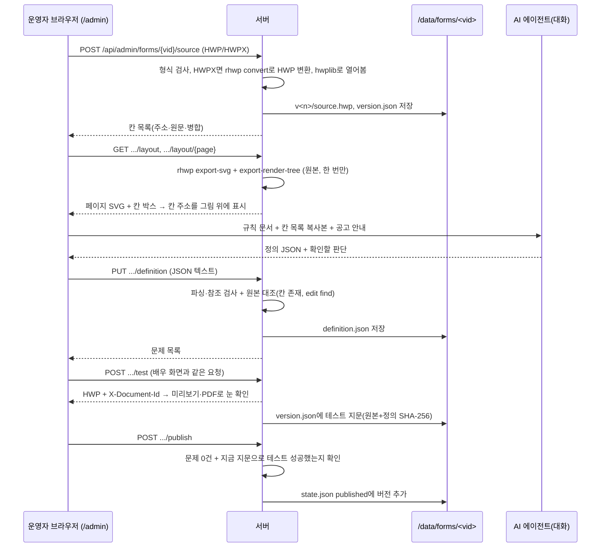
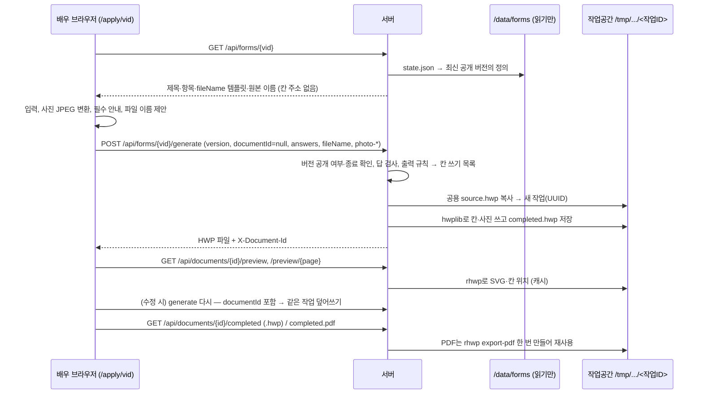

# 예술in 지원서 서비스 — 동작 구조 정리

공고별 작성 링크(`/apply/{vid}`)를 중심으로, **누가(사람·에이전트·브라우저·서버) 무엇을 어디서 하는지**를 코드 기준으로 정리한 문서다. 직접 업로드 흐름(`/`)은 같은 엔진을 쓰므로 차이만 짧게 적는다.

---

## 1. 한눈에 보기



| 주체 | 하는 일 | 하지 않는 일 |
|---|---|---|
| **운영자(사람)** | 공고 확인, 원본 업로드, 정의 JSON 검토·저장, 테스트 생성으로 눈 확인, 공개·종료, 링크 공유 | — |
| **AI 에이전트**(운영자가 대화로 쓰는 Claude Code·Codex) | `design/form-definition-guide.md`와 칸 목록을 보고 **정의 JSON 초안과 판단 목록을 대화로 돌려준다** | 서버 호출, 공개, 서비스 안에서 실행되는 것 없음. 서비스 코드에는 AI가 없다 |
| **브라우저**(React, `frontend/`) | 화면 그리기, 입력 받기, 사진 변환(HEIC→JPEG), 필수 항목 안내, 파일 이름 제안, 다운로드·공유 시트, 인앱 브라우저 처리 | 문서 파일을 만들지 않는다. 칸 주소를 모른다(배우 화면) |
| **서버**(Spring Boot, `backend/`) | 정의 검증, 답 검사, 출력 규칙 적용, **HWP 쓰기(hwplib)**, **PDF·미리보기(rhwp)**, 파일 이름 확정, 저장·만료, 권한 | 칸 추론(공고 링크에서는 안 함), 개인정보 로그 |

---

## 2. 전체 흐름

### 2-1. 운영자: 링크 만들기



### 2-2. 배우: 링크에서 지원서 만들기



---

## 3. 브라우저가 맡는 것 (`frontend/src`)

### 입구 나누기
- `Root.tsx`: 주소로 화면을 고른다. `/apply/<숫자>` → `form/ApplyApp`, `/admin…` → `admin/AdminApp`, 그 외 → `App`(직접 업로드).
- 서버(`web/AppRoutes.java`)는 `/apply/{vid}`, `/admin`, `/admin/forms/{vid}` 요청에 같은 `index.html`을 돌려준다. 로컬에서는 Vite가 대신한다.

### 배우 화면 (`form/`)
| 파일 | 역할 |
|---|---|
| `ApplyApp.tsx` | 공고 양식 불러오기 → 작성 → 생성 → 완성 화면. 작업 ID를 기억해 수정 시 같은 작업으로 다시 생성 |
| `NoticeFillScreen.tsx` | 제목, 항목들, **완성 파일 이름 칸**, 필수 남은 개수, "지원서 만들기" |
| `ItemInput.tsx` | 타입별 입력: text(한 줄/여러 줄), phone(전화 키패드), single/multi(칩, multi는 `max` 넘으면 막음), photo |
| `useAnswers.ts` | 답·사진 상태. 사진은 `photo.ts`로 변환. 수정 시트 취소용 스냅숏 |
| `fileName.ts` | **파일 이름 제안**(아래 6절) |
| `api.ts` | `GET /api/forms/{vid}`, `POST .../generate` 요청 만들기. 답은 `{항목id: [값…]}`, 사진은 `photo-<항목id>` |
| `types.ts` | 항목·양식 타입, `missing()`(필수 남은 항목) |

브라우저가 **하지 않는 것**: 칸 주소·문서 원문을 받지 않는다. 체크 표시(`( V )`, `■`), 복합 입력 조합, 전화번호 최종 형식은 서버가 정한다. 브라우저의 필수 검사·`max` 제한은 안내용이고, 서버가 다시 검사한다.

### 공통 화면·기능 (업로드 흐름과 같이 씀)
| 파일 | 역할 |
|---|---|
| `DoneScreen.tsx` | 완성 화면: 미리보기, 칸 눌러 수정(시트), 확대, 저장·메일 버튼. 무엇을 수정할지는 부모가 `labels`·`renderEditor`로 넘긴다 |
| `PreviewPage.tsx`, `PreviewZoom.tsx` | 서버가 준 SVG 페이지 위에 누를 수 있는 칸(hotspot)을 겹쳐 그림 |
| `photo.ts` | PNG 8MB 이하는 그대로, 그 외(HEIC·WebP·큰 JPEG)는 캔버스로 다시 그려 최대 2400px JPEG(품질 0.9). EXIF 회전도 이때 바로잡힘 |
| `useDelivery.ts`, `delivery.ts` | 한글로 저장(실제 URL로 다운로드), PDF로 저장(서버에 먼저 만들게 한 뒤 다운로드), 메일로 보내기(공유 시트, 안 되면 저장 후 메일 작성 화면) |
| `shell.ts`, `InAppNotice.tsx`, `platform.ts` | 카카오톡·안드로이드 인앱이면 열자마자 기본 브라우저로 넘김, 아니면 안내. 완성 후 인앱이면 주소를 `/?doc=<작업ID>`로 바꿔 "브라우저에서 이어하기"가 완성본을 이어받게 함 |
| `analytics.ts` | GA4. `apply.yesulin.art`에서만. 공고 링크는 `/apply/fill`, `/apply/done` 가상 페이지. 입력값·파일 이름·`?doc=`은 보내지 않음 |
| `OutputNameField.tsx` | 파일 이름 입력칸(두 흐름 공통) |

### 운영자 화면 (`admin/`)
| 파일 | 역할 |
|---|---|
| `AdminApp.tsx` | 토큰 입력(탭의 sessionStorage에만 저장), 공고 목록, 공고 열기 |
| `FormEditor.tsx` | 한 공고의 순서: 링크 패널 → 1 원본 → 2 칸 위치 → 3 정의 → 4 테스트 |
| `LinkPanel.tsx` | 상태(준비 중/공개 중/공개 종료), 배우 링크 복사, 공개·종료·재공개 |
| `LayoutPanel.tsx` | 원본 SVG 위에 칸 주소 표시(누르면 주소 복사), 칸 목록 표(**에이전트에게 줄 복사본**) |
| `DefinitionPanel.tsx`, `DefinitionGuide.tsx` | JSON 입력·저장, 문제 목록, 짧은 쓰는 법, 예시로 시작 |
| `TestPanel.tsx` | 편집 중 버전의 배우 화면(`FormFields`)으로 테스트 생성, 결과 미리보기·HWP·PDF 링크 |
| `adminApi.ts` | 모든 요청에 `Authorization: Bearer <토큰>`. 원본 페이지 그림도 토큰이 필요해 fetch → blob URL로 보여줌 |

---

## 4. 서버가 맡는 것 (`backend/src/main/java/kr/yesulin/actor`)

### 패키지
| 패키지 | 내용 |
|---|---|
| `form/` | **공고 양식**: 정의 해석·검증, 답 검사, 출력 조합, 공고·버전 저장, 운영자·배우 API |
| `document/` | **문서 엔진**: HWP 읽고 쓰기(hwplib), 사진 넣기, 작업공간(배우별 작업), 완성본 저장, PDF·미리보기(rhwp), 파일 이름, 직접 업로드 흐름의 칸 추론 |
| `web/` | 필터(토큰, 요청 제한, 보안 헤더, 로그), 오류 코드 변환, SPA 경로 |
| `stats/` | 완성 횟수(첫 화면 숫자) |

### 공고 양식 (`form/`)
| 파일 | 역할 |
|---|---|
| `FormController` / `AdminFormController` | 배우 API `/api/forms/**`, 운영자 API `/api/admin/forms/**` |
| `FormApplyService` | 배우 쪽 규칙: 공개된 적 없는 공고 → 404, 종료 → 410, 요청 버전이 공개 이력에 없으면 → 409 `FORM_CHANGED`. 열어 둔 화면은 연 버전으로 생성됨 |
| `FormAdminService` | 운영자 쪽: 업로드(못 읽는 파일은 저장 전에 거절), 정의 저장, 칸 위치, 테스트, 공개 조건 확인, 종료 |
| `FormBuilder` | **생성의 핵심**: 정의 읽기 → 답 검사 → 출력 조합 → 작업 만들기/재사용 → 문서 엔진에 쓰기 요청. 테스트 지문(SHA-256) 계산 |
| `FormStore` | 디스크 저장(`yesulin.forms-dir`). 공개된 버전은 다시 쓰지 않고, 고치면 새 버전(`draft()`) |
| `FormDefinitionParser`, `ItemParser`, `OutputParser` | JSON → 타입 있는 정의. 문제는 한 번에 모두 모아 알려줌 |
| `SourceCheck` | 정의를 원본과 대조: 칸 존재, `edit`의 `find` 글자 |
| `FormAnswers` | 답 검사: 필수, 선택지가 정의에 있는지, 전화번호, 길이, multi 개수. 배우에게 보일 문구로 거절(`INVALID_ANSWER`) |
| `FormComposer` | **출력 규칙 적용**: text/append/edit/photo/rows → 끼울 표 줄(`TableGrowth`)과 칸 쓰기 목록. 끼운 줄 아래 칸은 주소를 밀어 쓴다. 파일 이름 템플릿 채우기. 미리보기 hotspot 대상 |
| `Placeholders`, `PhoneNumber` | `{id}` 치환, 전화번호 형식(010-1234-5678, 02-123-4567) |

### 문서 엔진 (`document/`)
| 파일 | 역할 |
|---|---|
| `HwpDocument` | hwplib로 HWP 열기, 칸 목록(`cells()`), `setText`(칸을 비우고 쓰기, 줄마다 문단 서식 유지), `appendText`(라벨 아래 줄에), `insertImage`, `save` |
| `CellContent` | 칸 글자 지우기(빈 줄은 남겨 칸 높이 유지), **입력 글자 서식**: 양식에서 가장 많이 쓴 글꼴·표의 대표 크기, 검정, 굵게·밑줄 없음 |
| `CellImageInserter`, `PhotoPlacement` | 사진을 HWP 그림 개체로 넣기. 칸 안쪽 크기에 비율 유지로 맞춤(contain), 가운데 정렬 |
| `CompletedDocumentWriter` | 작업의 `source.hwp`를 열어(끼울 줄이 있으면 `RowInserter`가 rhwp로 줄을 끼운 임시 사본을) 칸 쓰기 목록을 적용하고 `completed.hwp`로 교체 저장. PDF·미리보기 캐시 지우기, 첫 완성만 횟수 +1(운영자 테스트는 제외) |
| `DocumentStore`, `StoredDocument` | 작업공간: 작업마다 UUID 폴더, 메모리 목록, 30분 만료, 5분마다 정리, 최대 300개 |
| `DocumentService` | 작업 시작(`startJob`: 공용 원본 복사), 작업 생성(`buildJob`: 주인 확인 후 쓰기), 완성본·PDF 내려주기, HWPX→HWP 변환, (업로드 흐름) 분석·생성 |
| `PdfConverter` | **rhwp CLI 실행기**: `export-pdf`, `export-svg`, `export-render-tree`, `convert`. 동시에 2개, 60초 제한 |
| `PreviewService`, `PageLayout` | rhwp 출력으로 페이지 크기·칸 위치 계산 → 미리보기 hotspot, 운영자 칸 위치 |
| `CompletedFileName` | 파일 이름 검사·기본값(6절) |
| `UploadValidator` | HWP/HWPX 시그니처·20MB, 사진 JPEG/PNG·12MB·8000px·4천만 화소 |
| `FieldExtractor` 외 | 직접 업로드 흐름 전용 칸 추론. 공고 링크에서는 쓰지 않음 |

### 웹 (`web/`)
| 파일 | 역할 |
|---|---|
| `AdminTokenFilter` | `/api/admin/**`: 토큰 미설정 → 404 `ADMIN_DISABLED`, 틀림 → 401 |
| `RateLimitFilter` | IP당 POST `/api/**` 10분 60회(운영자 API 제외) |
| `SecurityHeadersFilter` | CSP 등. API 응답은 캐시 금지(`no-store`), SVG도 스크립트 실행 불가 |
| `ApiExceptionHandler` | 예외 → 코드(`FORM_NOT_FOUND`, `FORM_CLOSED`, `FORM_CHANGED`, `FORM_NOT_READY`, `INVALID_ANSWER`, `INVALID_FILE_NAME` …). 프런트 `api.ts`의 문구표와 짝 |
| `AppRoutes` | `/apply/{vid}`, `/admin…` → `index.html` |

---

## 5. AI 에이전트에게 기대하는 것

- **입력**: `design/form-definition-guide.md` + 운영자 페이지 `칸 목록` 표 복사본 + 공고 안내(필수, 파일 이름 규칙, 사진 장수).
- **출력**: 정의 JSON 한 덩어리, 칸→항목 대응 요약, "운영자가 확인할 판단"(필수 여부, 선택지 표기, fileName, 넣지 않은 칸).
- **경계**: 에이전트는 초안만 쓴다. 맞는지는 서버 검증(저장 시)과 운영자의 테스트 생성이 판정한다. 공개는 운영자만 한다. HWP는 바이너리라 에이전트가 직접 읽지 못하므로 칸 목록을 줘야 한다(로컬에서 작업하는 에이전트는 운영자 API로 읽을 수도 있다).
- 에이전트가 자주 틀리는 곳: `find` 공백 개수(원문 그대로 복사), 라벨 칸에 값 쓰기, 쓰이지 않는 항목, 사진 칸 판단(물어보게 되어 있음).

---

## 6. 파일 이름은 어떻게 정해지나

```
정의 fileName 템플릿  "{name}_{age}_{role}_{phone}"
        │  (브라우저 form/fileName.ts가 답으로 채워 '완성 파일 이름' 칸에 제안)
        ▼
배우가 칸을 고치지 않으면 → 제안 이름을 그대로 보냄
배우가 고치면           → 고친 이름을 보냄 (이후로는 답이 바뀌어도 그대로)
        │  request.fileName
        ▼
서버 FormBuilder: fileName이 비면 FormComposer.fileName(템플릿 채우기)
        ▼
CompletedFileName.chosenOrDefault: 검사·확정
        ▼
Content-Disposition: attachment; filename*=UTF-8''<이름>.hwp  (PDF는 같은 이름 .pdf)
```

- 템플릿 채우기(브라우저·서버 같은 규칙): `{id}` → text는 입력값(줄바꿈은 공백), phone은 `010-1234-5678`, single은 선택지 `output` 또는 `label`, multi는 그것들을 `_`로 연결. `\ / : * ? " < > |`는 지운다.
- 답이 하나도 없어 템플릿이 비면: **원본 파일 이름 + `_완성`**(`이별장례식_오디션지원서_완성.hwp`).
- 서버 검사(`CompletedFileName`): `.hwp`/`.hwpx`는 떼고 본다. 1~100자, 제어문자·`\ / : * ? " < > |` 금지, `.`으로 끝나기 금지, `CON`·`NUL` 같은 예약어 금지. 어기면 400 `INVALID_FILE_NAME`("파일 이름에 경로 기호나 특수 문자를 넣을 수 없어요").
- 이 이름은 **내려받을 때의 이름**일 뿐이다. 서버 디스크에는 항상 `completed.hwp`, `completed.pdf`로 저장한다(파일 이름을 경로로 쓰지 않음).
- 직접 업로드 흐름은 원본 파일 이름 속 자리표시(`tf_(이름)_(성별).hwp`)를 브라우저(`src/fileName.ts`)가 채워 제안한다. 같은 `OutputNameField`, 같은 서버 검사.

---

## 7. HWP·PDF·미리보기는 누가 어디서 어떻게 만드나

**모두 서버**에서 만든다. 브라우저는 받아서 보여주고 저장만 한다.

| 결과물 | 만드는 곳 | 도구 | 언제 | 저장 위치 |
|---|---|---|---|---|
| 완성 HWP | `CompletedDocumentWriter` ← `HwpDocument` | **hwplib 1.1.11**(자바 라이브러리, JVM 안) | 생성 요청마다 | 작업공간 `<작업ID>/completed.hwp`(같은 작업은 덮어씀) |
| PDF | `DocumentService.completedPdf` ← `PdfConverter` | **rhwp CLI** `export-pdf`(별도 프로세스) + 한글 폰트 | 처음 PDF 요청 때 한 번, HWP를 다시 만들면 지우고 다시 | `<작업ID>/completed.pdf` |
| 미리보기 | `PreviewService` ← `PageLayout` | rhwp `export-svg`(페이지 그림) + `export-render-tree`(칸 위치) | 처음 미리보기 요청 때 한 번 | `<작업ID>/preview/` |
| 운영자 원본 그림 | `FormAdminService.layout` | 위와 같음 | 원본 버전마다 한 번 | `/data/forms/<vid>/v<n>/render/` |
| HWPX → HWP | `DocumentService.hwpSource` | rhwp `convert --verify` | 업로드할 때 | 원본으로 저장 |

### HWP 한 번 만들 때 서버 안에서 일어나는 일
1. `FormBuilder`가 정의를 읽고(`definition.json`) 답을 검사한다(`FormAnswers`).
2. 원본 칸 원문을 읽어(`HwpDocument.cells()`) `FormComposer`가 출력 규칙을 적용 → 칸 쓰기 목록(`CellWrite.Replace / Append / Photo`). 줄 표(`rows`) 답이 양식 줄보다 많으면 끼울 줄 목록(`TableGrowth`)도 함께 나온다.
   - `text`: 템플릿을 채운 글자로 칸 내용을 교체
   - `append`: 라벨은 두고 아래 줄에 추가
   - `edit`: 원문에서 `find`를 `replace`로 바꾼 전체 글자로 교체(서식은 칸의 문단 서식 유지)
   - `photo`: 사진 파일
   - 답이 없는 칸은 목록에 넣지 않는다 → 원본 그대로
3. 처음이면 공용 `source.hwp`를 작업 폴더로 **복사**해 새 작업(UUID)을 만든다. 두 번째부터는 받은 `documentId`의 작업을 쓴다(다른 공고·버전·테스트의 작업이면 새로 만든다).
4. `CompletedDocumentWriter`가 작업의 `source.hwp`를 **매번 새로** 열어(끼울 줄이 있으면 rhwp `edit insert-row`·`merge-cells`로 줄을 끼운 임시 사본을 열고, 다 쓰면 지운다) 칸을 쓰고(사진은 형식·크기 검사 후 그림 개체로), 임시 파일에 저장한 뒤 `completed.hwp`로 바꿔치기한다. 그래서 다시 만들어도 이전 답이 겹쳐 쌓이지 않는다.
5. 응답 본문이 HWP 파일 자체이고, 헤더 `X-Document-Id`로 작업 ID를 돌려준다.

### 실행 환경
- 로컬: rhwp는 `tools/install-rhwp.sh`로 `tools/rhwp/`에 설치(`yesulin.rhwp.path`). 없으면 PDF·미리보기·HWPX만 안 되고 HWP 생성은 된다.
- 운영(Railway): `Dockerfile` 하나에 프런트 빌드 결과, 백엔드 jar, rhwp, 한글 폰트(`fonts-nanum`, `fonts-noto-cjk`)가 같이 들어간다. 한컴 전용 글꼴은 없어서 PDF·미리보기 글자 모양이 원본과 조금 다를 수 있다. **HWP 파일 자체는 원본 글꼴 지정을 그대로 가진다.**

---

## 8. 저장과 수명

| 데이터 | 위치 | 수명 | 누가 쓰나 |
|---|---|---|---|
| 공고 원본·정의·상태 | `yesulin.forms-dir` (로컬 `backend/data/forms`, 운영 `/data/forms` 볼륨) | 계속(재배포해도 남음) | 운영자 API만 |
| 배우 작업(원본 복사본, 사진, 완성 HWP·PDF, 미리보기) | `yesulin.workspace` (운영 `/tmp/yesulin-actor`) | **30분**, 재시작하면 사라짐 | 배우 생성 API |
| 배우의 답 | 브라우저 메모리 | 새로고침하면 사라짐(서버에 답을 저장하지 않음) | 브라우저 |
| 완성 횟수 | `/data/completed-count.txt` | 계속 | 첫 완성마다 +1 |
| 로그 | `/data/logs` | 14개 회전 | 작업 ID·개수·시간만. 이름·답·파일 이름·사진은 남기지 않음 |

공고 폴더 모양:
```
/data/forms/22370/state.json          {"published":[1,2],"closed":false}  마지막 값이 링크가 보여주는 버전
/data/forms/22370/v1/source.hwp       원본
/data/forms/22370/v1/definition.json  붙여넣은 정의 그대로
/data/forms/22370/v1/version.json     원본 파일 이름, 테스트 지문
/data/forms/22370/v1/render/          운영자용 원본 그림
```

---

## 9. ID와 버전 — 섞이지 않는 이유

- **vid**: 공고를 찾는 열쇠. 링크에만 들어간다. 여러 배우가 같은 vid를 쓴다.
- **버전**: 공개한 버전은 다시 쓰지 않는다. 원본이나 정의를 고치면 새 버전이 생기고, 테스트 후 다시 공개한다. 배우 화면은 연 버전을 생성 요청에 실어 보내므로, 그 사이 새 버전이 공개돼도 연 버전대로 완성된다.
- **작업 ID(UUID)**: 배우 한 명의 결과. 첫 생성 때 생기고, 이후 수정 생성·다운로드·미리보기·`?doc=` 이어받기에 쓴다. 작업에는 주인 표시(`form:<vid>:v<버전>`, 운영자 테스트는 `test:…`)가 있어서 다른 공고 작업 ID로는 쓸 수 없다.
- **공용 원본은 읽기만 한다**: 배우 요청은 작업 폴더의 복사본만 쓴다. 테스트로 원본·정의가 그대로인지 확인한다.

---

## 10. 보안·제한 요약

- 운영자 API: `YESULIN_ADMIN_TOKEN`(Railway 변수). 비면 운영자 기능이 꺼진다. `/admin` 화면 자체는 누구나 열 수 있지만, 데이터는 토큰 없이는 오지 않는다.
- 배우 API는 공개다. 대신 요청 제한(IP당 10분 60회), 동시 작업 300개, 업로드 크기(문서 20MB, 사진 12MB), 서버 측 답 검사가 있다.
- 완성본은 작업 ID만 알면 30분 동안 받을 수 있다. 그래서 작업 ID(`?doc=`)는 분석·로그로 보내지 않는다.
- 미리보기 SVG는 업로드된 문서에서 만들어지므로 API 응답에 스크립트 실행 금지 CSP를 건다.

---

## 11. 무엇을 바꾸려면 어디를 보나

| 하고 싶은 것 | 볼 곳 |
|---|---|
| 정의에 새 입력 타입·설정 추가 | `form/FormItem`, `ItemParser`, `FormAnswers`(검사·쓰는 값), 프런트 `form/types.ts`, `ItemInput.tsx`, `fileName.ts`, 규칙 문서 2개 |
| 새 출력 방식 추가 | `form/FormOutput`, `OutputParser`, `FormDefinitionParser`(참조 검사), `FormComposer`, `SourceCheck` |
| 입력 글자 모양(글꼴·크기·색) | `document/CellContent` |
| 사진 크기·배치 | `document/CellImageInserter`, `PhotoPlacement` |
| 파일 이름 규칙 | 브라우저 `form/fileName.ts` + 서버 `FormComposer.fileName` (둘이 같은 규칙이어야 함), 검사는 `CompletedFileName` |
| 배우 화면 문구·배치 | `form/NoticeFillScreen.tsx`, `ItemInput.tsx`, `form/form.css` |
| 완성 화면(저장·메일·미리보기) | `DoneScreen.tsx`, `useDelivery.ts`, `delivery.ts` |
| 오류 문구 | 서버 `ApiExceptionHandler`(코드) ↔ 프런트 `api.ts`의 `MESSAGES` |
| 보관 시간·동시 작업 수·요청 제한 | `application.properties`(`yesulin.document-ttl`, `max-documents`, `rate-limit.*`) |
| 운영자 화면 | `admin/` |

## 12. 확인 방법

- 백엔드 테스트: `backend`에서 `gradlew test`. 공고 링크 테스트는 `kr.yesulin.actor.form`(합성 양식 `src/test/resources/forms/sample-notice.hwp`).
- 프런트 테스트: `frontend`에서 `npm test`, `npm run build`, `npm run lint`.
- 생성된 HWP 내용 확인: `tools/rhwp/rhwp/rhwp export-tables <파일.hwp> --json`(칸별 글자), `rhwp info <파일>`(쪽 수).
- 실제 한글 앱에서 열어보는 것, 실기기 인앱 브라우저 동작은 자동 테스트로 확인되지 않는다. 공고마다 테스트 생성 결과를 눈으로 보는 이유다.

## 관련 문서

- `design/notice-forms.md`: 공고 링크 설계 결정, API 표, 저장 구조
- `design/form-definition-guide.md`: 정의 JSON 규칙(에이전트용)
- `README.md`: 실행·배포·운영 흐름
